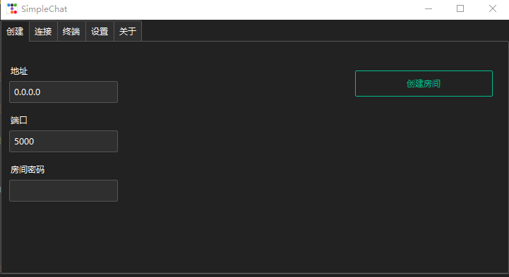

# SimpleChat-GUI
SimpleChat的GUI版本, 目前只是测试版

# 介绍
由于由于SimpleChat的控制台版本目前已经停止维护和编写, 所以给出了SimpleChat的控制台版本也就是SimpleChat-GUI

SimpleChat-GUI主要是基于Python的ttkbootstrap库编写
需要安装的库: `ttkbootstrap` `requests` `urllib3`

库安装命令: 
```cmd 
pip install ttkbootstrap requests urllib3
```
SimpleChat-GUI的界面如下:


# 使用方法
运行 `GUI.py` 文件
端口号默认为 `5000`
如果设置了房间密码客户端也需要在界面设置房间密码才加入

# 文件作用
SimpleChat-GUI的目录结构如下
```
├─ config.py
├─ GUI.py
├─ README.md
├─ img
│   └─ img0.png     
└─ libraries
     │  ├─ client.py
     │  └─ server.py
     ├─api
     │ ├─ terminal.py     
     │ └─ terminal.pyi    
     └─language
        ├─ en-us.json
        ├─ zh-cn.json     
        └─ zh-hk.json 
```
+ `GUI.py` 文件保存了界面和界面的基础互动
+ `config.py` 文件包含了软件初始化配置和基础配置
+ `libraries` 文件夹下包含了软件的各种功能
+ `server.py` 文件包含了服务端的所有功能
+ `client.py` 文件包含了客户端的所有功能
+ `api` 文件夹下保存了各类的api接口
+ `terminal.py` 文件有着关于软件的控制台的api
+ `language` 文件夹下保存了各种语言
+ `README.md` 一个描述文件

文件 `config.json` 会在第一次打开或者没有时创建, 正常使用时内容不需要修改

软件使用了几个简单的协议进行沟通

## 信息协议格式
```json
{
    "type": "消息类型",
    "message": "消息",
    "sender": "发送者"
}
```
软件之间的通信由这3种基本结构构成
+ `type` 目前支持的类型只有 `message`
+ `message` 内容为要发生的信息
+ `sender` 为客户端在服务端注册的名称

## 注册协议
客户端连接时需要先发送注册协议
```json
{
    "name": "注册的名称",
    "password": "服务器设置的密码"
}
```
+ `name` 为你在服务器要注册的名称
+ `password` 服务器设置的密码

协议通过时服务端也会发送历史信息
```json
[
    {
        "message": "内容",
        "sender": "发送者"
    },
    ...
]
```
历史信息为一个列表, 列表内每一项都是一条消息内容, 即使没有任何内容服务端也会回发一个空列表

每次发送消息时并不会直接显示在控制台, 而是发送到服务端后服务端回发给所有客户端, 此时每个客户端接收到了才显示包括发送信息的客户端

<span style="color: #cece;">只要协议正确, 无论是否是软件发送的都可以进行聊天</span>

# 扩展
目前可扩展只有语言文件
在 `libraries\language` 文件夹下创建一个 `*.json`
格式可以参考其他语言文件

以后会添加api接口和扩展功能, 使其能实现更多有趣的内容
